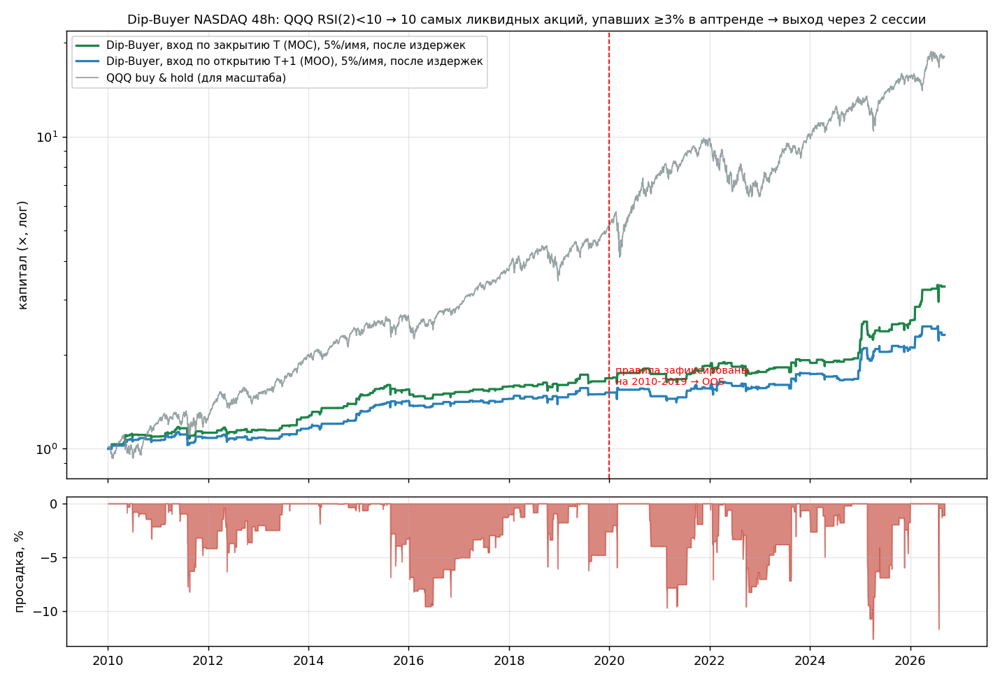

# Dip-Buyer NASDAQ 48h — готовая стратегия

> **Сразу главное.** Это единственный сетап из ~40 проверенных, который остался в плюсе после издержек на 17 годах данных, при этом правила были **зафиксированы на 2010–2019 и один раз проверены на 2020–2026** — без подгонки. Он даёт **~8–9% годовых при ~10% времени в рынке** (остальное — кэш), Sharpe ≈ 0.9, максимальная просадка −12.6%. Это не «удвоение за год». Стратегии с честной проверкой, которые дают на 48-часовом горизонте больше, на дневных данных я не нашёл — и скорее всего их там нет.

---

## 1. Правила (ровно так, как тестировалось)

| | |
|---|---|
| **Триггер рынка** | RSI(2) индекса **QQQ** по закрытию дня T **< 10** |
| **Фильтр акции** | close > SMA200 (аптренд) · сегодняшнее падение ≤ **−3%** · средний оборот 21д ≥ **$20M** · цена ≥ $5 |
| **Выбор** | **10 самых ликвидных** (по обороту) из прошедших фильтр. Не «самых упавших» — самых ликвидных |
| **Вход** | **по закрытию дня T** (MOC-ордер, ставится 15:50 ET по оценке) — основной вариант. Запасной: по открытию T+1 (MOO) — хуже на ~20–30 б.п./сделку |
| **Выход** | **по закрытию T+2** (MOC). Ровно две сессии. **Без стопов, без целей** |
| **Размер** | **5% капитала на имя** → когорта ≤ 50%. Сигнал два дня подряд → вторая когорта ещё 50%. Больше двух когорт быть не может. Без плеча |
| **Нет сигнала** | ничего не делаем. Сигнал ~24 дня в году, кучками по 1–3 дня |

Почему именно так — каждое правило имеет причину, а не подобрано:
- **QQQ RSI(2) < 10** — классический триггер «рынок перепродан за 2 дня» (Connors). Именно *условная* реверсия работает: тот же фильтр акций **без** триггера рынка убыточен (−25 б.п./сделку).
- **Акция упала ≥3% в аптренде** — добавляет +45 б.п. к простому «купить 10 ликвидных в день перепроданности» (77 против 33 б.п.).
- **Самые ликвидные** — сюрприз для многих, но это стабильнее «самых упавших» (в OOS: 60 vs 45 б.п., просадка −10% vs −16%) и снимает вопрос ёмкости.
- **Без стопа** — стоп −5% режет 24% сделок и снижает результат с 77 до 51 б.п. Реверсивные сделки нельзя стопить: стоп срабатывает ровно на дне.
- **Ровно 2 сессии** — 1 сессия убыточна (−13 б.п.), 3 сессии не лучше 2 по Sharpe. 48 часов — это и есть горизонт эффекта.

## 2. Результаты (после издержек 15 б.п. на мега-капах / 30 б.п. на остальных, за круг)

Вход по закрытию, 5% на имя:

| Период | Годовых | Sharpe | t-stat | Max DD | Худший день | Лет в плюсе | Сделок | Ср. сделка | Hit |
|---|---|---|---|---|---|---|---|---|---|
| **In-sample 2010–2019** | 5.4% | 0.88 | 2.8 | −9.6% | −4.8% | 9/10 | 1719 | +63 б.п. | 57% |
| **Out-of-sample 2020–2026** | **10.9%** | **0.93** | 2.4 | −12.6% | −6.1% | 6/7 | 1540 | +94 б.п. | 55% |
| Полный 2010–2026 | 7.5% | 0.86 | 3.5 | −12.6% | −6.1% | 15/17 | 3259 | +77 б.п. | 56% |

Вход по открытию T+1 (запасной вариант): 5.2% годовых, Sharpe 0.67, +55 б.п./сделку, 15/17 лет в плюсе.

Годовая доходность при 10% времени в рынке означает, что **на задействованный капитал** это ~80–90% годовых; остальное время деньги свободны (T-bills / другая стратегия).

По годам (вход по закрытию):

| Год | Сигн. дней | Сделок | б.п./сделку | Год, % | Max DD | QQQ, % |
|---|---|---|---|---|---|---|
| 2010 | 24 | 155 | +119 | +9.4 | −3.3 | +20 |
| 2011 | 34 | 236 | +26 | +2.9 | −8.2 | +3.5 |
| 2012 | 33 | 198 | +24 | +2.2 | −5.9 | +18 |
| 2013 | 12 | 83 | +225 | +9.7 | −0.7 | +37 |
| 2014 | 22 | 160 | +173 | +14.7 | −1.9 | +19 |
| 2015 | 32 | 245 | +58 | +7.0 | −6.8 | +9 |
| 2016 | 27 | 168 | −20 | **−1.8** | −6.7 | +7 |
| 2017 | 16 | 116 | +72 | +4.2 | −1.4 | +33 |
| 2018 | 24 | 230 | +11 | +1.0 | −6.0 | 0 |
| 2019 | 15 | 128 | +80 | +5.1 | −6.2 | +39 |
| 2020 | 11 | 110 | +61 | +3.2 | −4.0 | +48 |
| 2021 | 19 | 189 | +67 | +6.3 | −6.0 | +27 |
| 2022 | 45 | 388 | −21 | **−4.5** | −9.6 | −33 |
| 2023 | 18 | 175 | +104 | +9.1 | −3.5 | +55 |
| 2024 | 20 | 198 | +108 | +10.9 | −4.6 | +26 |
| 2025 | 30 | 300 | +133 | +20.3 | −12.6 | +21 |
| 2026 (8 мес.) | 18 | 180 | +299 | +29.0 | −11.7 | +17 |



## 3. Проверки на прочность (чтобы вы не поверили мне на слово)

- **Соседние параметры.** Сетка RSI ∈ {8,10,12,15} × падение ∈ {2,3,4%} × имён ∈ {5,10,20}: **все 36 точек в плюсе, все с t > 2**. Выбранная точка — не пик, а середина плато.
- **Против случайного выбора в те же дни:** случайные 10 ликвидных имён — +20 б.п., только QQQ — +32 б.п., наш фильтр — +77 б.п.
- **Bootstrap по месячным блокам (2000 прогонов):** Sharpe 90% CI = 0.52…1.26; годовая 5.2%…13.1%; P(Sharpe < 0) = 0.000; вероятность убыточного случайного 12-месячного окна ≈ 16%.
- **Выбросы.** Без топ-1% сделок средняя падает с 77 до 44 б.п. (всё ещё плюс), без топ-5% — около нуля. **Правый хвост — часть edge**, поэтому нет ни целей, ни частичной фиксации.
- **Survivorship.** Данные — сегодняшний состав NASDAQ, делистингованных нет. Смягчено тем, что торгуются 10 самых ликвидных (медианный ранг ликвидности — 46-й в NASDAQ, медианный оборот $271M/день; AMD, MU, TSLA, NVDA, AMZN, AVGO — самые частые). Такие имена делистятся редко. Но истинный результат, вероятно, на 10–20 б.п./сделку ниже показанного.
- **Ошибка оценки в 15:50.** Если RSI на закрытии окажется в зоне 10–20 — такие дни в среднем дают ≈ 0 (не убыток). Пограничные дни (RSI 8–12) — на ваш выбор, но не катастрофа.

## 4. Риски — прочитайте, прежде чем ставить деньги

1. **Это ловля ножей на распродажах.** Худший день −6%, худшая сделка −32% (за 2 дня). В 2022-м стратегия потеряла 4.5% — на медвежьем рынке реверс слабее. Просадка −12.6% (2025) случилась за одну неделю.
2. **Корреляция с рынком в момент сделки 0.63.** Если вы одновременно держите лонг QQQ — в дни сигнала риск удваивается.
3. **Кластеризация.** Сигналы идут сериями: две когорты по 50% = 100% капитала в акциях, упавших за день на 3–10%, посреди распродажи. Так и задумано, но надо это осознавать. При плече эта стратегия убьёт счёт.
4. **Ёмкость.** До ~$5M на когорту без заметного влияния на цену (MOC на именах с оборотом $100M+). Дальше — начинайте с 5 самых ликвидных.
5. **Издержки.** Расчёт: 15 б.п. за круг на мега-капах. IBKR Pro + MOC/MOO — укладывается. У брокера с комиссией 0.1% за сторону edge сократится вдвое.
6. **Отчётности.** Акция, упавшая на 3% *после отчёта* (гэп), в выборке есть, и результат её включает. Дополнительно фильтровать не стал — в бэктесте этого не было, и добавлять непроверенное не буду.
7. **Психология.** 44% сделок убыточны. Сигнал появляется, когда в новостях паника. Если вы пропустите 5 лучших дней из 400 — заберёте на четверть меньше.

## 5. Как запускать

```bash
pip install yfinance pandas numpy
cd strategy

# Вариант A (основной): 15:45–15:55 ET (22:45–22:55 по Хайфе летом, 23:45 зимой)
python dip_buyer.py --live --universe universe_nasdaq.csv --capital 100000
#   -> если сигнал: список из ≤10 тикеров, размер позиции; ставите MOC-ордера на покупку.
#   -> через 2 сессии: MOC-ордера на продажу всей когорты.

# Вариант B (проще): после закрытия, вход по открытию следующего дня
python dip_buyer.py --universe universe_nasdaq.csv --capital 100000
#   -> MOO-ордера на покупку завтра; продажа MOC через 2 сессии после дня входа.
```

Сканер проверен на историческом сигнальном дне (2026-08-20): выбирает **те же 10 имён, что и бэктест** (MRNA, CRWD, MDB, AXON, UAL, OKTA, SITM, STLD, CHYM, BIIB → +0.1% средняя за 48 ч).

Сегодня (2026-09-08) сигнала нет: QQQ RSI(2) = 71.

## 6. Что лежит рядом

- `dip_buyer.py` — сканер/генератор ордеров (live и after-close режимы)
- `results/trades_2010_2026.csv` — все 3259 сделок бэктеста с ценами и результатом
- `results/by_year.csv`, `results/summary.csv` — таблицы выше
- `research/PLAN.md` — протокол исследования (написан **до** прогона OOS), `research/*.py` — весь код: скачивание, панель, in-sample обзор 40 сетапов, OOS-прогон, робастность

## 7. Что я проверил и отверг (чтобы вы не тратили на это время)

На 2010–2019, после издержек, вход по открытию, 2 сессии: пробой 52-недельного максимума (−22 б.п.), гэп вверх на объёме (−28), momentum-burst (−26), топ-дециль 6-месячного моментума (−12), безусловный реверс −4% (−25), RSI(2) акции < 5 (−2), 3 дня падения подряд (−7), overnight-премия (−15), turn-of-month (−13…0), pre-move-фильтр из репо (−15). **На горизонте 1–2 дня без интрадей-данных и новостей работает только условная реверсия — покупка ликвидных акций в аптренде в дни, когда продают всё.**

## Дополнение (10.09.2026): пики каждый день, тиры A / B / C

Запрос: сигналы каждый день, а не 2 дня в месяц. Проверено на 2016–2026 (1 407 акций NASDAQ, топ-2 по обороту из прошедших фильтр «>SMA200, день ≤ −3%, оборот ≥ 20M$», вход по открытию, выход по закрытию через 48 ч, издержки 15 б.п.):

| условие по QQQ RSI(2) | сделок | средняя | медиана | прибыльных | лет в плюсе | 2016–20 | 2021–26 |
|---|---|---|---|---|---|---|---|
| < 10 (A) | 419 | +54 б.п. | +36 | 53% | 6/10 | +15 | +69 |
| 10–20 | 427 | +12 | +25 | 53% | 6/10 | +38 | +0 |
| 20–30 | 364 | +38 | +25 | 54% | 5/10 | +42 | +36 |
| **10–30 (B)** | 791 | **+24** | +25 | 53% | 6/10 | +40 | +15 |
| 30–50 | 578 | −34 | −13 | 49% | 3/10 | +33 | −74 |
| 50–70 | 680 | −46 | −33 | 47% | 2/10 | −5 | −73 |
| ≥ 70 | 1 948 | −19 | −18 | 48% | 5/10 | −5 | −28 |
| **≥ 30 (C)** | 3 206 | **−28** | −19 | 48% | 3/10 | +1 | −46 |
| каждый день без условия | 4 416 | −11 | −7 | 49% | 4/10 | +9 | −22 |

Другие «каждодневные» варианты того же фильтра (5-дневный откат ≤ −8%, RSI2 акции < 5, закрытие ниже 20-дневного минимума, моментум +3%) — все от −5 до −19 б.п. за сделку. Вывод не изменился: сделка окупается только когда падает весь рынок. Компромисс: **тир B (RSI2 10–30)** добавлен в торгуемые — это ~10 сделок в месяц вместо ~4, ценой снижения средней с +54 до +34 б.п. Тир C выдаётся каждый день как «наблюдение» и ведётся в paper-журнале отдельно, чтобы на живых данных было видно, подтверждается ли его минус. Скрипт: `research/daily_tiers.py`, таблица: `results/daily_rules_2016_2026.csv`.
